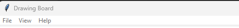

# Drawing Board

## 👁️ Overview

This project implements a simple drawing board based on [*Linkfy*](https://www.youtube.com/@Linkfydev) YouTube tutorial:
[*"Crea un Paint en Python | Fácil"*](https://youtu.be/mqv1n4lIExg?si=9YqUx_p-55iywy_m).

## Setup and run

See [SETUP.md](doc/SETUP.md) for prerequisites and step-by-step instructions for
Windows, macOS, and Linux. With Python and GNU Make installed, run `make setup`
once, then `make run` to open the application.

## 💻 Menu Bar functions

| Layer | Function     | keyboard shortcut | Info                                                                          |
|-------|--------------|-------------------|-------------------------------------------------------------------------------|
| File  | Save Drawing | **Ctrl+S**        | Save current drawing.  User can select path, name and format (png or jpg) |
| File  | Import Image | **Ctrl+I**        | Import local image to draw                                                    |
| File  | Exit         | -                 | Exit the application                                                          |
| View  | Switch Theme | **Ctrl+T**        | Switch between black and white theme                                          |
| Help  | Show Help    | **Ctrl+H**        | Show keyboard shortcuts help                                                  |

### Other keyboard shortcut
- **Ctrl+Z** → Undo lines

## 📄 Disclaimer

This project is an extension of the code extracted from 
[*"Crea un Paint en Python | Fácil"*](https://youtu.be/mqv1n4lIExg?si=9YqUx_p-55iywy_m) [*Linkfy´s*](https://www.youtube.com/@Linkfydev) video.

I am not the original author of the base code; I have only made modifications and improvements for educational and learning purposes.

## 🔗 References
* **Linkfy**, *Crea un Paint en Python | Fácil* → https://youtu.be/mqv1n4lIExg?si=9YqUx_p-55iywy_m
* **pythontutorial.net**, *Tkinter Menu* → https://www.pythontutorial.net/tkinter/tkinter-menu/
* **geeksforgeeks.org**, *Python Tkinter - MessageBox Widget* →  https://www.geeksforgeeks.org/python/python-tkinter-messagebox-widget/
* **Fabio Musanni - Programming Channel**, *Python Tkinter Menu Widget | Create Menu Bar in Tkinter | Menus & Submenus in Tkinter GUI App* → https://youtu.be/7Z2J7NdsCRc?si=IKqcsOv1FxS1cIdQ

