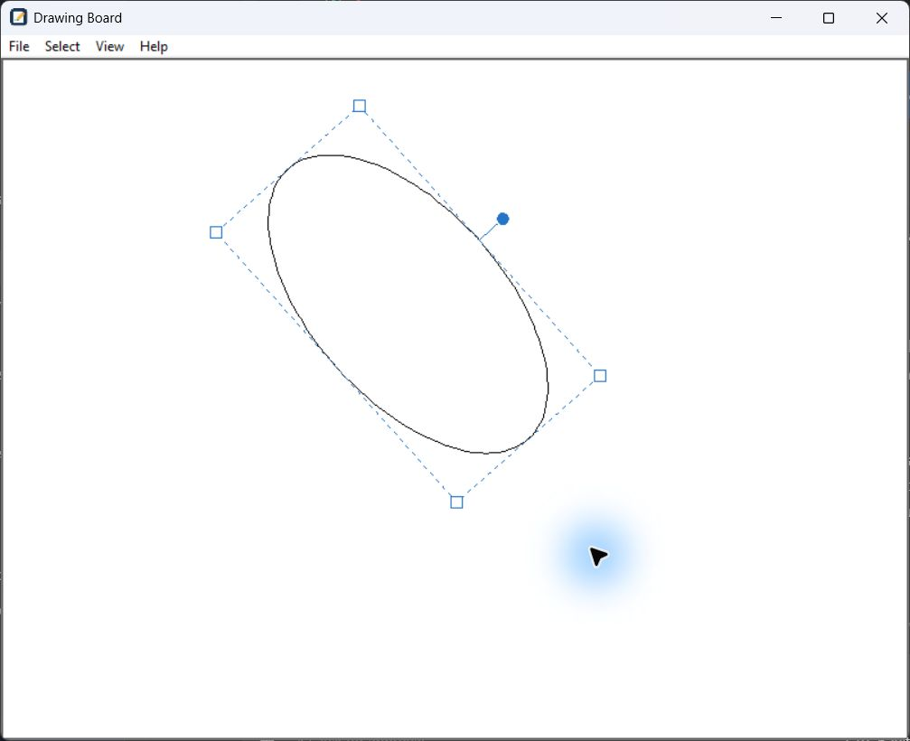

# Drawing Board


## 👁️ Overview

This project implements a simple drawing board based on [*Linkfy*](https://www.youtube.com/@Linkfydev) YouTube tutorial:
[*"Crea un Paint en Python | Fácil"*](https://youtu.be/mqv1n4lIExg?si=9YqUx_p-55iywy_m).


Draw freehand lines or single-click dots, choose pencil colors, and erase marks
with a rubber tool. Add outlined rectangles, ellipses, and triangles, then resize
and rotate them. Pencil, rubber, and figure borders share an adjustable size.
The app also supports black and white canvas themes, image import, PNG/JPEG
export, undo, and a formatted Help window with the Drawing Board logo.

The demo above shows an earlier version; the controls below describe the current app.

### Color and thickness toolbar


The strip below the menus shows the current drawing color and shared thickness.
Click the color square to open the existing color picker; canceling keeps your
selection. The square follows theme changes for default colors, while custom
colors remain fixed. It shows the retained drawing color even in rubber mode.

Drag the small vertical thumb along the Thickness bar. **0% means 1 pixel** and
**100% means 50 pixels**; percentages are rounded from the actual integer width.
The slider and size shortcuts stay synchronized. Tab to the slider and use arrow
keys to adjust by one pixel; Enter or Space activates the focused color square.
In figure mode, one completed slider drag changes the selected border as one undo
action. Undo restores the figure width while retaining the shared size preference.
Escape, focus loss, a tool change, or a dialog cancels an unfinished drag and
restores its starting size. The toolbar is never included in exported images.

## Setup and run

See [SETUP.md](doc/SETUP.md) for prerequisites and step-by-step instructions for
Windows, macOS, and Linux. With Python and GNU Make installed, run `make setup`
once, then `make run` to open the application.

## 💻 Menu Bar functions

| Layer | Function     | keyboard shortcut | Info                                                                          |
|-------|--------------|-------------------|-------------------------------------------------------------------------------|
| File  | Save Drawing | **Ctrl+S**        | Save current drawing. <br/>User can select path, name and format (png or jpg) |
| File  | Import Image | **Ctrl+I**        | Import local image to draw                                                    |
| File  | Undo All     | **Ctrl+Shift+Z**  | Clear pencil marks and figures after confirmation; keep imported images |
| File  | Exit         | -                 | Exit the application                                                          |
| Select | Color       | **Ctrl+Shift+C**  | Choose the color for new strokes and figures |
| Select | Pencil      | **Ctrl+Shift+P**  | Switch back to drawing |
| Select | Rubber      | **Ctrl+Shift+R**  | Erase pencil marks |
| Select | Figures     | **Ctrl+Shift+F**  | Choose a figure or edit existing figures |
| View  | Switch Theme | **Ctrl+T**        | Switch between black and white theme                                          |
| Help  | Show Help    | **Ctrl+H**        | Show keyboard shortcuts help                                                  |

### Other keyboard shortcuts

- **Ctrl+Z** → Undo a drawing segment, dot, figure creation/edit, image import, or rubber stroke
- **Ctrl + + / -** → Increase or decrease the active tool size by 1 pixel

### Undo All

Choose **File → Undo All** (**Ctrl+Shift+Z**) to remove all pencil lines, dots, and figures
while keeping imported images. A warning asks **“Are You sure you want to undo all design?”**
Choose **OK** to accept or **Cancel** to keep the design; Cancel is selected by
default. This clears drawing, figure editing, and rubber history, so **Ctrl+Z cannot restore the
cleared marks**. Image imports remain in undo history and can still be undone
individually with **Ctrl+Z**.
The selected tool, size, color, and canvas theme stay unchanged.

### Drawing lines and dots

Drag on the canvas to draw with the pencil. Click and release without moving to
draw a round dot using the current size and color. Dots can be undone and erased
with the rubber. A normal drag does not add an extra dot when released.

### Pencil cursor and size

Use **Select → Color** (**Ctrl+Shift+C**) to select a pencil color. By default, the pencil is black
on the white theme and white on the black theme. Custom selections (including
black and white selected in the color picker) and strokes drawn with those colors
keep their color when switching themes. Earlier strokes drawn with the default
color continue to follow the theme. Canceling the picker keeps the current color.

The drawing canvas uses a pencil pointer with a circular outline that reflects
the current stroke width. The default size is **1 pixel**, with a minimum of
**1 pixel** and a maximum of **50 pixels**.

- **Ctrl + +** increases the size by 1 pixel.
- **Ctrl + -** decreases the size by 1 pixel.
- **Ctrl + =** and **Ctrl + numeric keypad + / -** also work.
- The toolbar slider changes the same shared size with the mouse.

Further adjustments at either limit leave the size unchanged. Size changes apply
to new drawing segments and update the cursor outline immediately. The outline
is only a preview and is excluded from saved images. These shortcuts and limits
are also available under **Help → Show Help** (**Ctrl+H**).

The Help window groups shortcuts and shared tool sizes into indented sections, with
bold shortcut commands. It uses the Drawing Board logo instead of an information
icon. Scroll or use **Page Up / Page Down** to read all sections. Press
**Escape**, **Enter**, or **Close** to dismiss it.

### Standard figures



Open **Select → Figures** (**Ctrl+Shift+F**) and choose **Rectangle**, **Ellipse**,
or **Triangle**. Drag empty canvas space to place an outlined figure; its interior
is transparent. Equal width and height produce a square or circle. A click or
zero-area drag creates nothing. The chooser also offers **Edit existing figures**.

In figure mode, click a figure's border to select it (the topmost figure wins
when borders overlap). Drag a square corner handle to resize along the figure's
axes around its fixed center. Drag the round blue handle to rotate. Resizing
keeps the rotation and border width; crossing the center clamps dimensions to
1 pixel. Click empty space to deselect. **Escape** or switching tools cancels an
unfinished placement or transformation.

New figures inherit the current color and shared **1–50 pixel** tool size.
**Ctrl++ / Ctrl+-** (and existing aliases) also change the selected figure's
border in figure mode, as does the toolbar slider. Each completed placement, resize, rotation, or border
change is one **Ctrl+Z** action. Undoing a border change restores that figure's
width without changing the shared size preference. Color selection applies to
future artwork. Default-colored figures follow the theme; custom colors stay fixed.

Rubber preserves figures and imported images. **Undo All** clears figures after
confirmation. PNG/JPEG export includes committed figures and omits handles,
selection outlines, and previews. Figures are editable within the running app;
exported images do not retain editable figure objects. Moving, multi-selection,
fills, and partial figure erasure are not supported.

### Rubber

Choose **Select → Rubber** (**Ctrl+Shift+R**) to erase pencil marks by clicking
or dragging. The pointer changes to a rubber icon with a circular size outline.
Erasing cuts pencil segments, revealing the background or imported images beneath;
it does not paint over them or alter figures. **Ctrl+Z** restores the last rubber stroke.

The pencil and rubber share one size: **1 pixel by default**, adjustable from
**1 to 50 pixels** with **Ctrl + + / -** (including the alternate size shortcuts
above) or the toolbar slider. Switching tools keeps the current size, including changes made with the
rubber selected. Choose **Select → Pencil** (**Ctrl+Shift+P**) to resume drawing
with the previous pencil color. The rubber icon and size outline are excluded
from saved images.

## Development and tests

- `main.py`: Tkinter application, menus, Help, drawing tools, undo, and image I/O.
- `toolbar.py`: color swatch, thickness slider, and percentage conversion.
- `eraser.py`: geometry for cutting pencil segments along a rubber drag.
- `figures.py`: immutable figure models, transforms, and border hit testing.
- `figure_tool.py`: chooser, canvas rendering, editing gestures, and figure undo.
- `logo.py`: Pillow renderer for the application logo.
- `tests/test_main.py`: application, dialogs, drawing, dots, color, Help, and export tests.
- `tests/test_eraser.py`: rubber geometry and stateful canvas behavior tests.
- `tests/test_figures.py`: figure geometry, stateful editing, undo, themes, and export tests.
- `tests/test_toolbar.py`: thickness mapping, toolbar layout, and pointer/keyboard controls.
- `media/logo.png`: logo used in this README; the app renders its icon at runtime.

Run `make test`, or use PowerShell from the repository root:

```powershell
.\.venv\Scripts\python.exe -m unittest discover -v
```

On macOS/Linux, use `.venv/bin/python -m unittest discover -v`. Tests mock Tk
widgets, dialogs, and file I/O where needed, so they run without opening windows
or requiring Ghostscript. They cover size limits, tool switching, dots, custom
color preservation, rubber cuts and undo, figure transforms and cancellation,
mixed figure/image history, Help, and export cleanup. Launch the
app to check cursor rendering and native dialogs manually; real image export
requires the prerequisites in [SETUP.md](doc/SETUP.md).

## 📄 Disclaimer

This project is an extension of the code extracted from 
[*"Crea un Paint en Python | Fácil"*](https://youtu.be/mqv1n4lIExg?si=9YqUx_p-55iywy_m) [*Linkfy´s*](https://www.youtube.com/@Linkfydev) video.

I am not the original author of the base code; I have only made modifications and improvements for educational and learning purposes.

## 🔗 References
* **Linkfy**, *Crea un Paint en Python | Fácil* → https://youtu.be/mqv1n4lIExg?si=9YqUx_p-55iywy_m
* **pythontutorial.net**, *Tkinter Menu* → https://www.pythontutorial.net/tkinter/tkinter-menu/
* **geeksforgeeks.org**, *Python Tkinter - MessageBox Widget* →  https://www.geeksforgeeks.org/python/python-tkinter-messagebox-widget/
* **Fabio Musanni - Programming Channel**, *Python Tkinter Menu Widget | Create Menu Bar in Tkinter | Menus & Submenus in Tkinter GUI App* → https://youtu.be/7Z2J7NdsCRc?si=IKqcsOv1FxS1cIdQ

